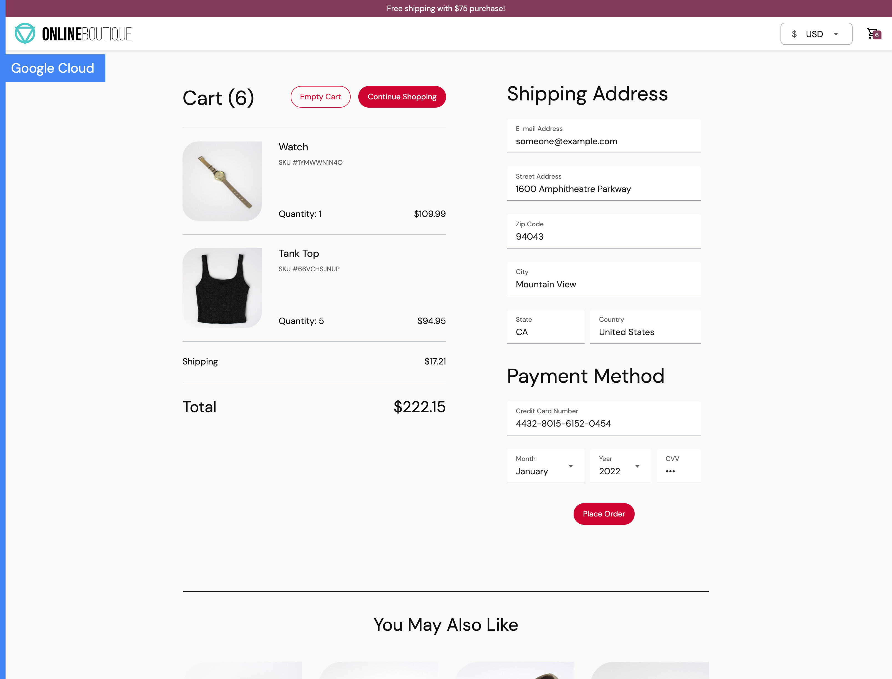

This is a cloud-first microservices NFT shop application.
Online NFT shop consists of an 11-tier microservices application. The application is a
web-based NFT e-commerce app where users can browse items,
add them to the cart, and purchase them.


## Screenshots

| Home Page                                                                                                         | Checkout Screen                                                                                                    |
| ----------------------------------------------------------------------------------------------------------------- | ------------------------------------------------------------------------------------------------------------------ |
| [](./docs/img/online-boutique-frontend-1.png) | [](./docs/img/online-boutique-frontend-2.png) |

## Quickstart (GKE)

[](https://ssh.cloud.google.com/cloudshell/editor?cloudshell_git_repo=https://Nftsale_cash_delivery&cloudshell_workspace=.&cloudshell_tutorial=docs/cloudshell-tutorial.md)

1. **[Create a Google Cloud Platform project](https://cloud.google.com/resource-manager/docs/creating-managing-projects#creating_a_project)** or use an existing project. Set the `PROJECT_ID` environment variable and ensure the Google Kubernetes Engine and Cloud Operations APIs are enabled.

```
PROJECT_ID="<your-project-id>"
gcloud services enable container.googleapis.com --project ${PROJECT_ID}
```

2. **Clone this repository.**

```
git clone https://Nftsale_cash_delivery.git
cd microservices-demo
```

3. **Create a GKE cluster.**

- GKE autopilot mode (see [Autopilot
overview](https://cloud.google.com/kubernetes-engine/docs/concepts/autopilot-overview)
to learn more):

```
REGION=us-central1
gcloud container clusters create-auto onlineshop \
    --project=${PROJECT_ID} --region=${REGION}
```

- GKE Standard mode:

```
ZONE=us-central1-b
gcloud container clusters create onlineshop \
    --project=${PROJECT_ID} --zone=${ZONE} \
    --machine-type=e2-standard-2 --num-nodes=4
```

4. **Deploy the sample app to the cluster.**

```
kubectl apply -f ./release/kubernetes-manifests.yaml
```

5. **Wait for the Pods to be ready.**

```
kubectl get pods
```

After a few minutes, you should see:

```
NAME                                     READY   STATUS    RESTARTS   AGE
adservice-76bdd69666-ckc5j               1/1     Running   0          2m58s
cartservice-66d497c6b7-dp5jr             1/1     Running   0          2m59s
checkoutservice-666c784bd6-4jd22         1/1     Running   0          3m1s
currencyservice-5d5d496984-4jmd7         1/1     Running   0          2m59s
emailservice-667457d9d6-75jcq            1/1     Running   0          3m2s
frontend-6b8d69b9fb-wjqdg                1/1     Running   0          3m1s
loadgenerator-665b5cd444-gwqdq           1/1     Running   0          3m
paymentservice-68596d6dd6-bf6bv          1/1     Running   0          3m
productcatalogservice-557d474574-888kr   1/1     Running   0          3m
recommendationservice-69c56b74d4-7z8r5   1/1     Running   0          3m1s
redis-cart-5f59546cdd-5jnqf              1/1     Running   0          2m58s
shippingservice-6ccc89f8fd-v686r         1/1     Running   0          2m58s
```

7. **Access the web frontend in a browser** using the frontend's `EXTERNAL_IP`.

```
kubectl get service frontend-external | awk '{print $4}'
```

*Example output - do not copy*

```
EXTERNAL-IP
<your-ip>
```

**Note**- you may see `<pending>` while GCP provisions the load balancer. If this happens, wait a few minutes and re-run the command.

8. [Optional] **Clean up**:

```
gcloud container clusters delete onlineshop \
    --project=${PROJECT_ID} --zone=${ZONE}
```

## Use Terraform to provision a GKE cluster and deploy Online Shop

The [`/terraform` folder](terraform) contains instructions for using [Terraform](https://www.terraform.io/intro) to replicate the steps from [**Quickstart (GKE)**](#quickstart-gke) above.

## Other deployment variations

- **Istio**: [See these instructions.](docs/service-mesh.md)
- **Anthos Service Mesh**: [See these instructions](/docs/service-mesh.md)
- **non-GKE clusters (Minikube, Kind)**: see the [Development Guide](/docs/development-guide.md)

## Deploy Online Shop variations with Kustomize

The [`/kustomize` folder](kustomize) contains instructions for customizing the deployment of Online Shop with different variations such as:
* integrating with [Google Cloud Operations](kustomize/components/google-cloud-operations/)
* replacing the in-cluster Redis cache with [Google Cloud Memorystore (Redis)](kustomize/components/memorystore) or [Google Cloud Spanner](kustomize/components/spanner)
* etc.

## Architecture


[](./docs/img/architecture-diagram.png)

Find **Protocol Buffers Descriptions** at the [`./pb` directory](./pb).

| Service                                              | Language      | Description                                                                                                                       |
| ---------------------------------------------------- | ------------- | --------------------------------------------------------------------------------------------------------------------------------- |
| [frontend](./src/frontend)                           | Go            | Exposes an HTTP server to serve the website. Does not require signup/login and generates session IDs for all users automatically. |
| [cartservice](./src/cartservice)                     | C#            | Stores the items in the user's shopping cart in Redis and retrieves it.                                                           |
| [productcatalogservice](./src/productcatalogservice) | Go            | Provides the list of products from a JSON file and ability to search products and get individual products.                        |
| [currencyservice](./src/currencyservice)             | Node.js       | Converts one money amount to another currency. Uses real values fetched from European Central Bank. It's the highest QPS service. |
| [paymentservice](./src/paymentservice)               | Node.js       | Charges the given credit card info (mock) with the given amount and returns a transaction ID.                                     |
| [shippingservice](./src/shippingservice)             | Go            | Gives shipping cost estimates based on the shopping cart. Ships items to the given address (mock)                                 |
| [emailservice](./src/emailservice)                   | Python        | Sends users an order confirmation email (mock).                                                                                   |
| [checkoutservice](./src/checkoutservice)             | Go            | Retrieves user cart, prepares order and orchestrates the payment, shipping and the email notification.                            |
| [recommendationservice](./src/recommendationservice) | Python        | Recommends other products based on what's given in the cart.                                                                      |
| [adservice](./src/adservice)                         | Java          | Provides text ads based on given context words.                                                                                   |
| [loadgenerator](./src/loadgenerator)                 | Python/Locust | Continuously sends requests imitating realistic user shopping flows to the frontend.                                              |

## Features

- **[Kubernetes](https://kubernetes.io)/[GKE](https://cloud.google.com/kubernetes-engine/):**
  The app is designed to run on Kubernetes (both locally on "Docker for
  Desktop", as well as on the cloud with GKE).
- **[gRPC](https://grpc.io):** Microservices use a high volume of gRPC calls to
  communicate to each other.
- **[Istio](https://istio.io):** Application works on Istio service mesh.
- **[Cloud Operations (Stackdriver)](https://cloud.google.com/products/operations):** Many services
  are instrumented with **Profiling**, **Tracing** and **Debugging**. In
  addition to these, using Istio enables features like Request/Response
  **Metrics** and **Context Graph** out of the box. When it is running out of
  Google Cloud, this code path remains inactive.
- **[Skaffold](https://skaffold.dev):** Application
  is deployed to Kubernetes with a single command using Skaffold.
- **Synthetic Load Generation:** The application demo comes with a background
  job that creates realistic usage patterns on the website using
  [Locust](https://locust.io/) load generator.


